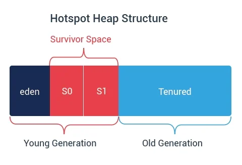

# JVM Architecture & Execution Engine — Deep Complete Notes

## 1. Introduction

The Java Virtual Machine (JVM) is a virtual computer that executes Java bytecode.
It consists of:
- Class loading system
- Runtime memory areas
- Execution engine
- Garbage collector
- JIT compiler
- Native interface (JNI)

Understanding the JVM is essential for writing efficient, scalable, and robust backend systems.

This document explains the JVM from the moment a .class file is loaded until it becomes running machine code.

## 2. High-Level JVM Architecture


## 3. Class Loader Subsystem

The class loader is responsible for loading .class files into memory.

### 3.1 Types of Class Loaders

1. **Bootstrap ClassLoader**
   - Implemented in native C
   - Loads core JDK classes (java.lang, java.util, etc.)
   - Highest priority in delegation

2. **Extension (Platform) ClassLoader**
   - Loads Java extensions (crypto, security libraries, etc.)

3. **Application (System) ClassLoader**
   - Loads application classes
   - Loads libraries from classpath
   - This is the default class loader for your code

### 3.2 Parent Delegation Model

All class loaders follow parent-first loading:

`Application → Extension → Bootstrap`

Before loading a class, a class loader asks its parent.
If parent cannot load it, only then the child loads it.

**Benefits:**
- Avoids reloading core classes
- Prevents malicious overriding of JDK classes
- Ensures consistent class definitions

## 4. Class Loading Phases (3-Step Process)

### Phase 1: Loading
- Reads the .class file
- Creates a Class object in the Method Area

### Phase 2: Linking

Linking has 3 sub-phases:

#### a) Verification
Ensures:
- valid bytecode format
- no illegal instructions
- no stack overflows / underflows
- correct operand usage

Guarantees JVM safety.

#### b) Preparation
Allocates memory for all static variables and assigns default values:

```java
int x; // 0
boolean flag; // false
String s; // null
```

#### c) Resolution
Replaces symbolic references with actual memory references.

Example:
Bytecode references "java/lang/Object" → resolved to a real class entry.

### Phase 3: Initialization
Executes:
- static variable assignments
- static blocks

```java
static {
    System.out.println("Class Loaded");
}
```

After this, the class is ready to be used.

## 5. Runtime Data Areas (Memory Layout)

This is all the memory the JVM uses while running.

### 5.1 Method Area (Class-Level Memory)

Stores:
- Class metadata
- Static variables
- Final constants
- Method bytecode
- Field/method tables
- Runtime constant pool
- String pool

Shared among all threads.

### 5.2 Heap Memory (Object Storage)

Heap stores:
- Objects
- Instance variables
- Arrays

Heap is shared and therefore must be protected in multithreading.

#### Heap Structure (Generational Design)



The generational model exists because:
- Most objects die young.
- This makes GC more efficient.

### 5.3 Java Stacks (Thread-Local Memory)

Each thread has its own stack.

Every method call creates a stack frame containing:
- local variables
- method parameters
- return address
- references to heap objects

Stack frames are removed once the method ends.

### 5.4 PC Register (Program Counter)

Each thread has a PC register storing the address of the next instruction.

### 5.5 Native Method Stack

Used when Java calls C/C++ code through JNI.

## 6. Execution Engine

This is where Java bytecode becomes machine code and runs.

The execution engine contains:
- Interpreter
- JIT Compiler
- Garbage Collector

### 6.1 Interpreter (Bytecode Executor)

The interpreter executes bytecode line-by-line.

**Advantages:**
- Fast startup
- Immediate execution

**Disadvantages:**
- Slow for repeating code (loops, frequently called methods)

This is why JIT exists.

### 6.2 JIT Compiler (Just-In-Time Compiler)

The JIT compiler converts hot bytecode into native machine code.
Native code runs directly on the CPU → very fast.

**How does JVM detect “hot” code?**
Using internal counters:
- method invocation count
- loop execution count

When a method becomes "hot", JIT compiles it.

### 6.3 JIT Optimizations (Very Important)

1. **Method Inlining**
   - Small frequently used methods get replaced inside the caller to reduce overhead.

2. **Escape Analysis**
   - If an object does not escape a method, JVM may allocate it on the stack instead of heap.
   - This reduces:
     - GC work
     - memory overhead

3. **Dead Code Elimination**
   - Removes unused / unreachable code.

4. **Loop Unrolling**
   - Optimizes tight loops for speed.

5. **Constant Folding**
   - Calculates constants during compilation.

JIT transforms Java into near-C++ performance.

## 7. JVM Execution Pipeline (Step-by-Step)

```text
.java file 
    ↓ compiled by javac
.class file (bytecode)
    ↓ loaded by ClassLoader subsystem
Verification → Preparation → Resolution → Initialization
    ↓ stored in Method Area
Execution Engine starts:
    ↓ Interpreter executes bytecode
    ↓ Hot code detected
JIT compiles into native machine code
    ↓ Native code executed at CPU speed
Garbage Collector runs in background
```

## 8. Native Interface (JNI)

JNI allows Java to call native languages like C/C++.

Used for:
- File systems
- Databases
- Compression
- Hardware access
- Video codecs

Native calls execute in the Native Method Stack.

## 9. Complete Summary (1-Minute Revision)

- ClassLoader loads classes (Bootstrap → Extension → Application)
- Linking ensures valid and usable class
- Initialization runs static blocks
- Method Area stores class metadata
- Heap stores objects
- Java Stack stores method calls + locals
- PC Register stores next instruction
- Interpreter runs bytecode
- JIT compiles hot code to native
- JVM dynamically optimizes code
- Garbage Collector manages heap memory

JVM = Class Loading + Memory Management + Execution Engine.

## 10. Interview Questions

1. **Explain JVM architecture.**
   - It consists of the Class Loader Subsystem (loading classes), Runtime Data Areas (memory like Heap, Stack), and the Execution Engine (Interpreter, JIT, GC) to execute bytecode.
2. **What are the phases of class loading?**
   - Loading (reading .class file), Linking (Verification, Preparation, Resolution), and Initialization (running static blocks).
3. **Why does JVM use a generational heap?**
   - Because most objects die young. Separating them into Young and Old generations allows for efficient "Minor GCs" that only scan a small part of the heap, improving performance.
4. **Interpreter vs JIT?**
   - **Interpreter**: Executes bytecode line-by-line, fast startup but slow execution.
   - **JIT**: Compiles hot bytecode to native machine code for faster execution, but has slower startup/warmup.
5. **What is method inlining?**
   - A JIT optimization where a method call is replaced by the actual method body code, eliminating the overhead of the function call.
6. **What is escape analysis?**
   - A JIT optimization that checks if an object is used only within a method. If so, it may allocate the object on the Stack instead of the Heap to reduce GC pressure.
7. **Why is parent delegation model needed?**
   - To ensure security and prevent core Java classes (like `java.lang.String`) from being overwritten by custom classes. Classes are loaded by the parent loader first.
8. **What is the role of the Method Area?**
   - It stores class metadata, static variables, constants, and method bytecode. It is shared among all threads.